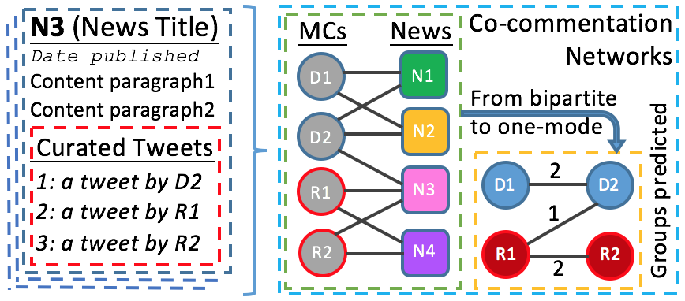

---
title: Research
Date: 2014-06-23 23:21
Author: toz
Slug: research
Status: published
link-citations: true
...

You can read my [research statement](https://www.dropbox.com/s/gq33huszyai361v/reserch-statement.pdf?dl=0) in PDF here.

Here is [a list](https://docs.google.com/spreadsheets/d/1jIOmaatpbToWJMhobzADzOay-PRjtBMIcfSRmm5HPTo) of conferences and workshops on computational social science where you can learn about the most recent studies in the field. Below is a selected research of mine:

-   [Digital Trails of Work Stressors](https://osf.io/wxcqp)
-   [Computational Social Science of Disasters: Opportunities and Challenges](https://www.mdpi.com/1999-5903/11/5/103)
-   [Attribution of Responsibility and Blame Regarding a Man-made Disaster: \#FlintWaterCrisis](https://www.frontiersin.org/articles/10.3389/fcomm.2018.00045/full)
-   [113th Congress as Online News Commentators](http://talhaoz.com/2015/03/113th-congress-as-news-commentators-on-twitter/)
-   [Measuring Media-Party Parallelism by Audience Compositions](http://talhaoz.com/2015/04/measuring-media-party-parallelism-by-audience-compositions/)

Research Statement
------------------

As our knowledge about astronomy dramatically increased right after the invention of the telescope, cheap computational power along with the open data movement now promise a similar advancement for our behavioral and social knowledge. To make this promise real, I work on traditional social scientific problems with methods from computer and information sciences. The computational methods that I use in attacking my research problems include (1) social data analysis and online crowdsourcing (for data curation, surveying, or experimentation), and (2) social complexity analysis and simulation (e.g. agent-based modeling).

**Social Data Analysis and Online Crowdsourcing.** For the first time in the history of human, we have social interactions recorded in much more greater detail and scale than ever before. Until now, collecting social and behavioral data has been very expensive; today, however, researchers have access to activities of billions of people all around the world, for free. Besides, these huge behavioral records are in a format that is ready to be processed by our computers. What is more, as the digital revolution continues to unfold, public social data is getting bigger and richer every day. Therefore, rigorously collecting and scientifically analyzing this unobtrusive observational social data becomes an important issue. It allows us to step into the untapped fields of social science as well as computational and data sciences. Because, when we attack a social scientific research question to empirically construct a theory by exploiting digital traces, then a computational research problem arises, that is, figuring out which computational tools to use on which data sources, and how to use them. The empirical tools (methods) in this regard include social network analysis, geo-informatics, information retrieval, data mining, machine learning, computational linguistics (NLP), data visualization, and crowdsourcing (micro-tasking). Meanwhile, the data sources are either authoritative (as many governments join the open data movement), commercial (platforms from which data can be collected via provided APIs or purchased), or they are free but difficult to collect (requires implementation of specific scrapers as such sources are not designed for providing structured data). Throughout my studies, I have used all of the mentioned computational methods and data sources to investigate a variety of social problems.

My dissertation, *collective stress in the digital age*, uses various computational methods to examine social responses to stressful events (such as technological and man-made disasters, terror attacks, government oppressions, economic crises, epidemic diseases, and political breakdowns) by exploiting publicly available unobtrusive observational social media data. For instance, one of the questions I examine in my dissertation is how citizens assign responsibility and blame regarding a man-made disaster [(Oz and Bisgin [2016](#ref-oz_attribution_2016))]{.citation}, an important topic in electoral behavior as individuals tend to think of political issues in terms of questions of responsibility, and as blame carries far more weight in voting behavior than that of credit. For this study, I collected data on the Flint water crisis from Twitter over a six months period. This ended up with 665K posts by 282K different accounts. If I had not relied on such a data source and had not adapted a computational approach in data collection, and instead had attempted to do a survey or to use other traditional methods, it would have been very costly, if not impossible to conduct this study. Big data collection, therefore, is and will be, an important part of computational social science. Regarding computational and analytical methods, in this study, I computed the sentiments of microblog posts using a sentiment lexicon to measure citizens’ stance towards political agents and to test a hypothesis on contagion of complaining (based on peer effect and homophily); extracted citizens’ location information from their user profiles, geocoded them, and made a geospatial analysis to test a hypothesis on concerned geographies; hired human coders to label microblog posts and analyzed inter-rater agreement for verification; conducted statistical tests to see if the effect of political predisposition is significant in who one blames; and, to communicate the findings with the readers most effectively, created visualizations (appropriate plots and maps) when necessary. Through such an analysis I not only showed how the unobservability problem of disaster research can be addressed using social media data, but this study also exemplified the ways computational social scientific research can be designed for hypothesis testing in the sociology of disasters.

Finding original data sources, using them as proxies or instrumental variables cleverly, and analyzing them with innovative ways are some of the features of successful research. Taking a computational perspective on social scientific questions provides opportunities for gaining these traits, and this benefits not only social sciences but also computational sciences. While computational scientists find a new domain to develop algorithms that actually help solve a social or behavioral research problem; likewise, new datasets and computational methods help social scientists theorize about the phenomenon better. For instance, in [Oz ([2015](#ref-oz_113th_2015))]{.citation}, I created a unique dataset from a new media website to examine an important topic in political communication, agenda-setting behaviors of Members of Congress (MCs). The editors of this new media site manually monitor \~1,400 newsworthy people (including politicians, celebrities, journalists, and academics), and when any of them comments (tweets) about a news event, then the editors place that newsworthy tweet underneath the related news content. From data science perspective, it is a dataset of hundreds of thousands of newsworthy tweets classified by their topic, from which not only the machine learning community but also social scientists can benefit. By scraping two years of news articles, I created a dataset in relational format and made it available to the research community. Then, to examine the extent of the agenda building efforts of the Congresspeople, I constructed their co-commentation network (Fig. 1). My research proved that collectively MCs are very selective on the events they comment (and for that matter, on which they do not comment) to the extent that the political group of an MC can be predicted with 95% accuracy by algorithmically detecting groups within the co-commentation network.

||
|:---:|
|Dataset and network generation steps|

**Social Complexity Analysis and Computer Simulations.** Social life is complex, it is made up of many heterogeneous autonomous agents, interacting with each other, learning, and adapting their environment. Humans are rationally bounded, most of the time we do not have perfect knowledge and vision, and we are interdependent. Therefore, social systems show nonlinear behavior, and agent-based modeling (simulation) is one of the most effective ways to study such systems.

With simulations, we can create virtual societies and do lab experiments on our artificial agents (which otherwise would be unethical or impossible to do). We can test theories, model *what-if* scenarios, and explore how a community responds to a policy change. To this end, in one of my ongoing research projects [(Center for Social Complexity [2016](#ref-center_for_social_complexity_dtra_2016))]{.citation}, I am using Census demographic data to synthesize a population (with various individual traits, households, house/work/school locations) and embedded social networks. In order to model the behaviors in the literature on social responses to a nuclear weapon of mass destruction (WMD) attack, I then use this population in a spatially explicit simulation. When finished, the model will simulate how individuals affected by a nuclear bomb might react to it in the first 30 days (e.g. evacuation, foraging, shelter search, and migrating), while it also allowing us to test different scenarios. Thus, the simulation will have the potential to help government agencies and policy makers be better prepared for such a catastrophic event.

By developing data-informed as well as theory-driven research designs, my transdisciplinary work advances both social and computational sciences. Specifically, my dissertation, not only adds to disaster research by testing theories and informing policy makers on social responses to collective stress situations; but it also makes significant contributions to computational sciences by creating new datasets, computational methods, and research designs. For the future, I look forward to continue working on this line of solution-oriented computational social science studies in which I chase social scientific research questions by exploiting new data sources while developing new computational methods and research designs.

### References

::: {#refs .references}
::: {#ref-center_for_social_complexity_dtra_2016}
Center for Social Complexity. 2016. “DTRA Immediate Social Response to a Nuclear WMD Event.” <https://socialcomplexity.gmu.edu/projectsdtra/>.
:::

::: {#ref-oz_113th_2015}
Oz, Talha. 2015. “113th Congress as News Commentators on Twitter.” SSRN Scholarly Paper ID 2918958. Political Networks Workshops & Conference 2015. Portland, OR: American Political Science Association. <https://papers.ssrn.com/abstract=2918958>.
:::

::: {#ref-oz_attribution_2016}
Oz, Talha, and Halil Bisgin. 2016. “Attribution of Responsibility and Blame Regarding a Man-Made Disaster: \#FlintWaterCrisis.” In *ArXiv:1610.03480 \[Cs\]*. Indianapolis, IN. <https://arxiv.org/abs/1610.03480>.
:::
:::

### Selected Publications

Here is a list of my <a href="publications.html">publications</a>.
<!-- 1. this list is old
1.  **Talha Oz**, Halil Bisgin [“Attribution of Responsibility and Blame Regarding a Man-Made Disaster: \#FlintWaterCrisis.”](http://arxiv.org/abs/1610.03480) 4th International Workshop on Social Web for Disaster Management (SWDM/CIKM). Indianapolis, IN 2016.
2.  **Talha OZ** "113th Congress as News Commentators on Twitter" 8th Political Networks Conference (PolNet-8), Portland, OR Jun 2015
3.  **Talha OZ** "All the Commentaries That's Fit to Tweet" 1st Computational Social Science Summit (CSSS15), Evanston, IL May 2015
4.  **Talha OZ**, Janusz Wojtusiak “Turkish News Audience and Their Political Leanings on Twitter” 7^th^ Political Networks Conference (PolNet-7), Montreal, QC, Canada May 2014
5.  Che Ngufor, Janusz Wojtusiak, Andrea Hooker, **Talha OZ**, and Jack Hadley “Extreme Logistic Regression: A Large Scale Learning Algorithm with Application to Prostate Cancer Mortality Prediction” The Twenty-Seventh International Flairs Conference (FLAIRS-27) , Pensacola Beach, FL, May 2014
6.  **Talha OZ**, Janusz Wojtusiak “Specialty and Physician Referral Network” International Sunbelt Social Network Conference XXXIV (INSNA), St. Pete Beach, FL Feb 2014
7.  **Talha OZ** “Mining Progress Notes for Prediction of Activities of Daily Living” American Medical Informatics Annual Symposium (AMIA), Washington, DC Nov 2013
8.  **Talha OZ** “Mining Clinical Notes and Ontologies to Predict Functional Status” Healthcare Information and Management Systems Society, Williamsburg, VA Nov 2012 (best poster award)
9.  Hakan Kardes, **Talha OZ**, and Mehmet H. Gunes “Cheleby: A Subnet-level Internet Topology Mapping System” 4^th^ International Conference on Communication Systems and Networks (COMSNETS) Banglore, India, Jan 2012
10. Hakan Kardes, **Talha OZ**, Mehmet H. Gunes “Cheleby: An Internet Topology Mapping System” 3^rd^ workshop on Active Internet Measurements, San Diego, CA Feb 2011 (abstract review)
11. **Talha OZ** “Cheleby: Internet Topology Collection System” M.S. Thesis, Dec 2010
12. **Talha OZ**, Hakan Kardes, Mehmet H. Gunes “Cheleby: Subnet-level Internet Mapper” 2^nd^ workshop on Active Internet Measurements, San Diego, CA Feb 2010 (abstract review)
13. **Talha OZ**, M. Salih Gok “Fire Simulator and Wind Direction Detector” B.S. Thesis, Istanbul, Turkey, Jun 2008
14. Ahmed Yasin Koculu, **Talha OZ** “Encryption and Decryption with RSA Algorithm using Parallel Computing” TUBITAK Project Competition, Ankara, Turkey, Apr 2001 -->
